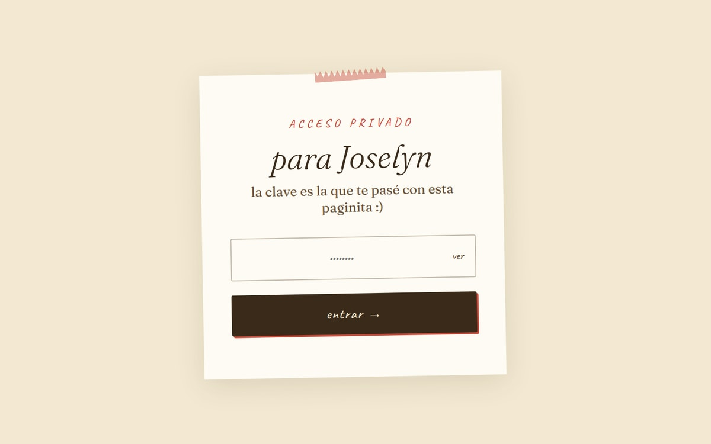

# Joselyn Pages

**Una página privada hecha con cariño para celebrar los 19 años de Joselyn.**

Recuerdos en formato polaroid, un vídeo, una carta de su hermano y confeti al abrirla.

---

*Hasta aquí llega quien no tenga la clave — y así debe ser.*

> [!NOTE]
> El contenido de dentro es personal: fotos, un vídeo, recuerdos y una carta. Por eso esta es la única captura del repositorio.

Desplegada en GitHub Pages: `https://renzoramosdev.github.io/Cuti-Birthday/`, con `noindex, nofollow` para que no la encuentre ningún buscador.

---

## Stack

- **React 18** vía CDN (sin bundler ni paso de build)
- **Babel Standalone** para JSX en el navegador
- CSS personalizado con estética de scrapbook / cuaderno

Se abre sirviendo la carpeta con cualquier servidor estático.

---

## Seguridad

La página es de acceso privado. El login deriva la clave en el navegador con **PBKDF2-SHA256 y 200 000 iteraciones** (`crypto.subtle`). En el código solo viven los hashes derivados; las claves originales nunca se almacenan. Se admiten **varias claves válidas**, todas con la misma seguridad.

| Medida | Detalle |
|---|---|
| Bloqueo progresivo | 5 minutos tras 5 intentos fallidos · 1 hora tras 10 |
| Suelo de tiempo | Mínimo 600 ms por intento, para no filtrar información por *timing* |
| Sesión | En `sessionStorage`: se pierde al cerrar la pestaña |
